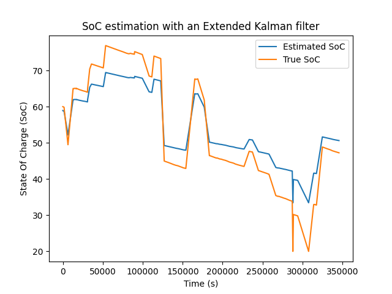

# Team7 - Huawei 2024 Nuremberg Tech Arena
Lithium-Ion Battery State of Charge Challenge  

## Project Description
The estimation of SoC in Lithium-Ion batteries is crucial for battery management systems, especially in electric vehicles, smartphones, and other portable devices. An accurate SoC estimation ensures optimal performance, prolongs battery life, and enhances user safety. Traditional methods often face challenges due to the non-linear characteristics of battery dynamics. This project leverages an **Extended Kalman Filter (EKF)** for real-time, accurate SoC estimation.  

We use an empirical model because we got the OCV-SOC relationship provided by the challenge. The model is based on the Open-Circuit Voltage (OCV) curve, which relates the SoC to the terminal voltage of the battery. The EKF algorithm handles the non-linear behavior of battery characteristics by linearizing the state and measurement equations around the current estimate. We also compute Jacobians for both the state transition and the measurement model to improve the estimation accuracy.  

## Code Structure
```plaintext
.
├── data/
│   ├── Scenario-1/                                        # Data files for different scenarios
|   |   ├── GenerateTestData_S1_Day0to4.xlsx
|   |   └── GenerateTestData_S1_Day4to7.xlsx
│   ├── Scenario-2/
|   |   ├── GenerateTestData_S2_Day0to4.xlsx
|   |   └── GenerateTestData_S2_Day4to7.xlsx
│   ├── Scenario-3/
|   |   ├── GenerateTestData_S3_Day0to4.xlsx
|   |   └── GenerateTestData_S3_Day4to7.xlsx
│   ├── Scenario-4/
|   |   ├── GenerateTestData_S4_Day0to4.xlsx
|   |   └── GenerateTestData_S4_Day4to7.xlsx
│   ├── Cha_Dis_OCV_SOC_Data.xlsx                          # OCV-SOC relationship
│   ├── EVE_HPPC_1_25degree_CHG-injectionTemplate.xlsx     # HPPC charging tests
|   └── EVE_HPPC_1_25degree_DSG-injectionTemplate.xlsx     # HPPC discharging tests
├── main.py                                                # Main script
├── README.md                                              # Project documentation
└── requirements.txt                                       # Python dependencies
```

## Usage
Run the `main.py` script with python and choose the excel file you would like to use for the analysis.

```bash
$ python main.py
Getting data from OCV-SOC file...
data_ocv_charge (head):
    [...]
data_ocv_discharge (head):
    [...]
0. Scenario-1/GenerateTestData_S1_Day0to4.xlsx
1. Scenario-1/GenerateTestData_S1_Day4to7.xlsx
2. Scenario-2/GenerateTestData_S2_Day0to4.xlsx
3. Scenario-2/GenerateTestData_S2_Day4to7.xlsx
4. Scenario-3/GenerateTestData_S3_Day0to4.xlsx
5. Scenario-3/GenerateTestData_S3_Day4to7.xlsx
6. Scenario-4/GenerateTestData_S4_Day0to4.xlsx
7. Scenario-4/GenerateTestData_S4_Day4to7.xlsx
Select data file: 
```

Input a number between 0 and 7, it will then give the plot and results after the computation.

## Extended Kalman Filter (EKF) Approach
We use an EKF algorithm to estimate the SoC by linearizing the non-linear state and measurement equations around the current estimate. This method involves computing Jacobians for both the state transition and the measurement model.

### Inspirations:
Papers:
> - Wei, J., Dong, G., & Chen, Z. (2017). On-board adaptive model for state of charge estimation of lithium-ion batteries based on Kalman filter with proportional integral-based error adjustment. Journal of Power Sources, 365, 308-319.  
> - Wang, W., & Mu, J. (2019). State of charge estimation for lithium-ion battery in electric vehicle based on Kalman filter considering model error. Ieee Access, 7, 29223-29235.  
> - Ahmed, M. S., Raihan, S. A., & Balasingam, B. (2020). A scaling approach for improved state of charge representation in rechargeable batteries. Applied energy, 267, 114880.  
> - El Maliki, A., Benlafkih, A., Anoune, K., & Hadjoudja, A. (2024). Reduce state of charge estimation errors with an extended Kalman filter algorithm. International Journal of Electrical and Computer Engineering (IJECE), 14(1), 57-65. doi:http://doi.org/10.11591/ijece.v14i1.pp57-65  


## Results
The project implemented an EKF-based SoC estimation algorithm, ...  

...  




## Dependencies
Install them using:  
```bash
pip install -r requirements.txt
```

## Acknowledgments
We would like to thank the organizers for organizing this challenge/hackathon.

## Team 7 Members
- **Chloé Blommaert**
- **Numa Deville**
- **Lucas Placentino**


> _All rights reserved._


----------------------------

Data from LiFePO4 Battery:
- capacity: 280Ah
- charge upper limit voltage: 3.65V
-  discharge lower threshold voltage: 2.5V
-  rated voltage: 3.2V
-  current rate range: 0~1C
-  rated current rate: 0.2C

data format: steps of 1 second

Criteria:
1. Accuracy: Maximum Absolute Error (MaxAE) measures the largest deviation between estimated and actual SoC values, assessing worst-case scenarios.
2. Robustness: Evaluates the algorithm's stability and accuracy across different conditions.
3. Efficiency: Assesses execution time, memory usage, and consistency across a uniform testing environment.
4. Transient Convergence: Measures the algorithm’s ability to quickly correct incorrect initial SoC values.
5. Documentation: Evaluates clarity, organization, and code quality.

Need good/high/best efficiency (good for embedded use) -> **avoid** neural networks, use system that can easily be made into an FPGA or ASIC, integratable into a BMS  
We'll use an empirical model (along with an electrical model ?) -> provided by the challenge  
1. (off-line) _OCV_-SOC relationship is predetermined  -> stored in lookup table or fitted by a math func
2. (off-line) Get model parameters
3. (on-line) Filtering to better estimation
> Wei, J., Dong, G., & Chen, Z. (2017). On-board adaptive model for state of charge estimation of lithium-ion batteries based on Kalman filter with proportional integral-based error adjustment. Journal of Power Sources, 365, 308-319.  

- Ampere hours integral (AHI) -> needs open circuit voltage (_OCV_)  
- Kalman filter (regular, (adaptive?) extended, (adaptive?) unscented, sigma-point, cubature ?) + regulator/observer (P, PI, PD or PID ?) for error correction/adjustment -> exteded KF because non-linear  
> Wang, W., & Mu, J. (2019). State of charge estimation for lithium-ion battery in electric vehicle based on Kalman filter considering model error. Ieee Access, 7, 29223-29235.

Assume that the open circuit voltage is error-free.  

> Ahmed, M. S., Raihan, S. A., & Balasingam, B. (2020). A scaling approach for improved state of charge representation in rechargeable batteries. Applied energy, 267, 114880.


> El Maliki, A., Benlafkih, A., Anoune, K., & Hadjoudja, A. (2024). Reduce state of charge estimation errors with an extended Kalman filter algorithm. International Journal of Electrical and Computer Engineering (IJECE), 14(1), 57-65. doi:http://doi.org/10.11591/ijece.v14i1.pp57-65

----------------------
Provided OCV-SOC relationship (100 datapoints x2: charge and discharge):  


----------------------
HPPC (Hybrid pulse power characterization) charging and discharging tests ? 
